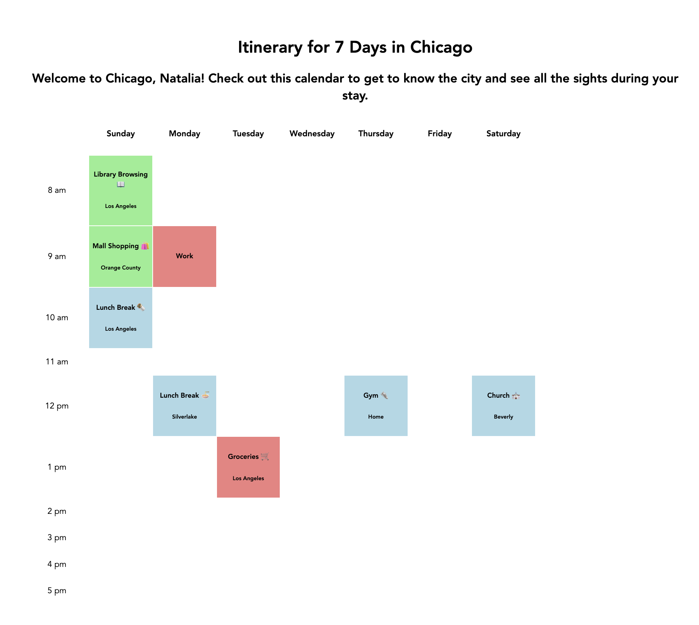

# Unit 1 Lab: Timetabled

## Overview

In this lab you'll build Timetabled, a grid-style one-week calendar of one-hour events. You'll plan the week for someone else (a friend, family member, historical figure, role model, or imaginary person), and it can be informative, humorous, or exploratory.

Need a spark? Try planning a vacation for a friend or pet, a week in the life of a historical figure, an adjustment to a polyphasic sleep cycle, or the week before a famous crime.

## What you'll build
- [x] Required: A one-week calendar that includes one-hour time blocks
- [x] Required: Events have different titles
- [x] Required: Events have different colors based on their type
- [x] Stretch: Event blocks have additional information, such as a description and location

## Resources: Vite • React components • JSX • props
- [Getting Started with Vite](https://vitejs.dev/guide)
- [ReactJS: Your First Component](https://react.dev/learn/your-first-component)
- [ReactJS: Writing Markup with JSX](https://react.dev/learn/writing-markup-with-jsx)
- [ReactJS: JavaScript in JSX](https://react.dev/learn/javascript-in-jsx-with-curly-braces)
- [ReactJS: Passing Props to a Component](https://react.dev/learn/passing-props-to-a-component)

## Tools & Technologies:
- GitHub
- Node.js
- npm
- React Framework
- Vite
- JavaScript, HTML, CSS, JSX, JavaScript XML

## How to Run Project:
1. Navigate to the project directory and install the dependencies:
```bash
cd timetabled
npm install
```
2. Run the command to start a localhost runtime of the code
```bash
npm run dev
```

## Results:
This image represents is what the code should bring up
